# State Machine Diagrams - Tiber Fantasy

This document contains state machine diagrams for the major stateful components in the codebase.

**Generated**: 2026-01-10
**PNG Images**: `docs/diagrams/*.png`
**Source Files**: `docs/diagrams/*.mmd`

---

## 0. System Overview

This diagram shows how all the major components connect together.

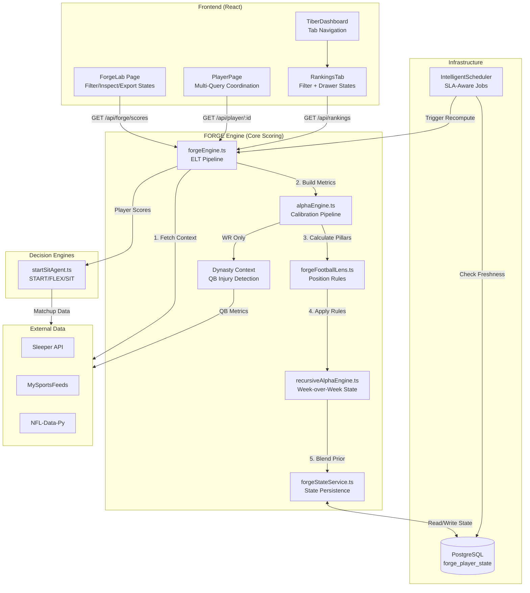

**Key Data Flows:**
1. **Frontend → FORGE**: API requests for player scores
2. **FORGE Pipeline**: FetchContext → BuildMetrics → ComputePillars → FootballLens → RecursiveAlpha
3. **State Persistence**: Week N state saved to `forge_player_state` for Week N+1 recursion
4. **External Data**: Sleeper (projections), MySportsFeeds (injuries), NFL-Data-Py (stats)

---

## 1. FORGE Recursive Alpha Engine

The core two-pass scoring system that maintains week-over-week player state.

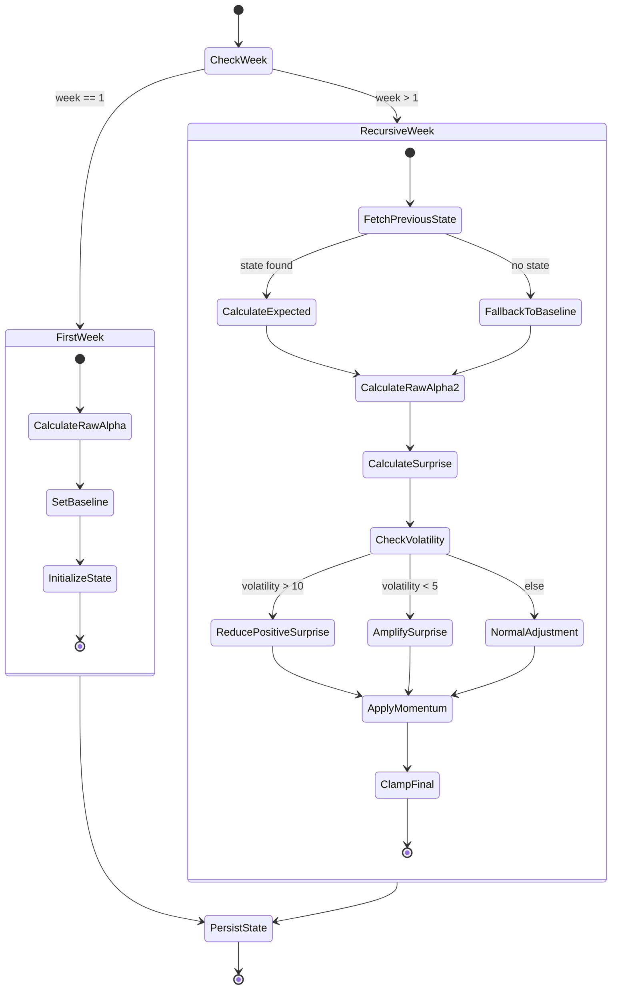

**State Definitions:**
- `FetchPreviousState`: Retrieves alphaPrev, tierPrev, volatility, momentum from `forge_player_state`
- `CalculateExpected`: `alphaPrev * 0.7 + baseline * 0.3`
- `CalculateSurprise`: `rawAlpha - expectedAlpha`
- `PersistState`: Saves to `forge_player_state` for next week's recursion

**File:** `server/modules/forge/recursiveAlphaEngine.ts`

---

## 2. FORGE Engine ELT Pipeline

The main scoring pipeline following Bronze → Silver → Gold data transformation.

```mermaid
stateDiagram-v2
    [*] --> FetchContext

    state FetchContext {
        [*] --> LoadRoleBank
        LoadRoleBank --> LoadTeamContext
        LoadTeamContext --> LoadSoSData
        LoadSoSData --> LoadQBContext
        LoadQBContext --> [*]
    }

    FetchContext --> BuildMetrics: context ready

    state BuildMetrics {
        [*] --> CreateMetricLookup
        CreateMetricLookup --> NormalizeMetrics
        NormalizeMetrics --> ComputeDerivedMetrics
        ComputeDerivedMetrics --> [*]
    }

    BuildMetrics --> ComputePillars: metrics ready

    state ComputePillars {
        [*] --> VolumeScore
        VolumeScore --> EfficiencyScore
        EfficiencyScore --> TeamContextScore
        TeamContextScore --> StabilityScore
        StabilityScore --> DynastyContext: position == WR
        StabilityScore --> [*]: position != WR
        DynastyContext --> [*]
    }

    ComputePillars --> ApplyFootballLens

    state ApplyFootballLens {
        [*] --> CheckTDSpike
        CheckTDSpike --> CheckVolumeMismatch
        CheckVolumeMismatch --> CheckPolarization
        CheckPolarization --> FlagIssues
        FlagIssues --> [*]
    }

    ApplyFootballLens --> OutputScore
    OutputScore --> [*]
```

**File:** `server/modules/forge/forgeEngine.ts`

---

## 3. FORGE Alpha Calibration Pipeline

The scoring calculation and calibration process.

```mermaid
stateDiagram-v2
    [*] --> ExtractFeatures

    ExtractFeatures --> CalculateSubScores

    state CalculateSubScores {
        [*] --> VolumeScore
        VolumeScore --> EfficiencyScore
        EfficiencyScore --> StabilityScore
        StabilityScore --> ContextFitScore
        ContextFitScore --> ApplyPPRModifier
        ApplyPPRModifier --> [*]
    }

    CalculateSubScores --> WeightedBlend

    state WeightedBlend {
        [*] --> LoadPositionWeights
        LoadPositionWeights --> ApplyWeights
        ApplyWeights --> SumWeightedScores
        SumWeightedScores --> [*]
    }

    WeightedBlend --> ApplyModifiers

    state ApplyModifiers {
        [*] --> EnvironmentModifier
        EnvironmentModifier --> MatchupModifier
        MatchupModifier --> [*]
    }

    ApplyModifiers --> CalibrateAlpha

    state CalibrateAlpha {
        [*] --> DetectZScore
        DetectZScore --> PositionCalibration
        PositionCalibration --> ClampRange
        ClampRange --> [*]
    }

    CalibrateAlpha --> CheckViewMode

    CheckViewMode --> ApplyDynastyAge: viewMode == dynasty
    CheckViewMode --> CalculateTrajectory: else

    state ApplyDynastyAge {
        [*] --> CheckAge
        CheckAge --> ApplyBoost: age < 27
        CheckAge --> ApplyDecay: age > 27
        CheckAge --> Neutral: age == 27
        ApplyBoost --> [*]
        ApplyDecay --> [*]
        Neutral --> [*]
    }

    ApplyDynastyAge --> CalculateTrajectory
    CalculateTrajectory --> CalculateConfidence
    CalculateConfidence --> [*]
```

**Trajectory States:**
- `Rising`: recent weighted avg > season avg by 6+
- `Declining`: recent weighted avg < season avg by 6+
- `Flat`: within 6 points

**File:** `server/modules/forge/alphaEngine.ts`

---

## 4. Dynasty Context Computation (WR Only)

Complex injury-aware QB evaluation for dynasty scoring.

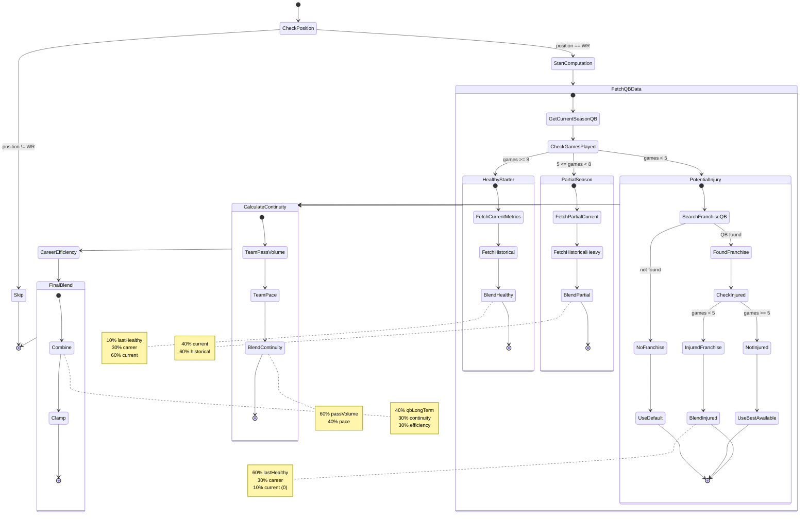

**File:** `server/modules/forge/forgeEngine.ts` (lines 641-850)

---

## 5. ForgeLab Page Component

React component state machine for the FORGE Lab interface.

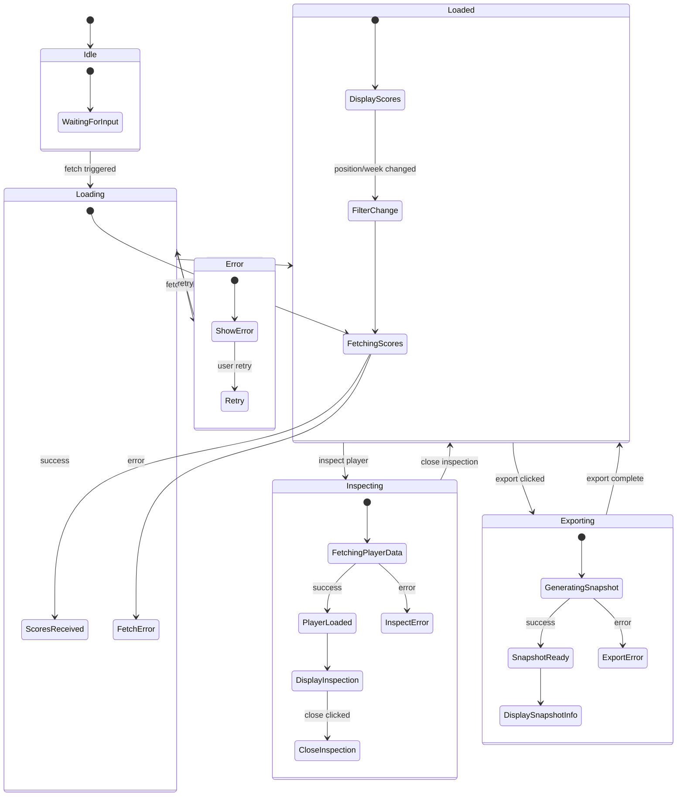

**State Variables:**
- `position`: QB | RB | WR | TE | ALL
- `loading`: boolean
- `scores[]`: ForgeScore[]
- `inspectId`: string | null
- `inspecting`: boolean
- `exporting`: boolean

**File:** `client/src/pages/ForgeLab.tsx`

---

## 6. PlayerPage Component

Multi-fetch async coordination for player detail view.

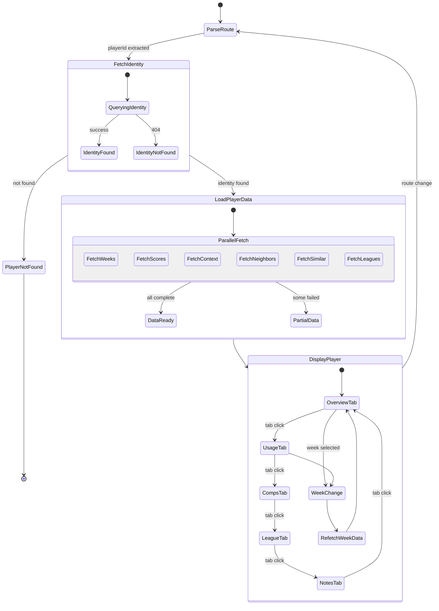

**Tab States:**
- `overview`: General player info + FORGE score
- `usage`: Usage metrics and trends
- `comps`: Similar player comparisons
- `league`: League ownership data
- `notes`: User notes

**File:** `client/src/pages/PlayerPage.tsx`

---

## 7. TiberDashboard / RankingsTab

Tab navigation and filter state management.

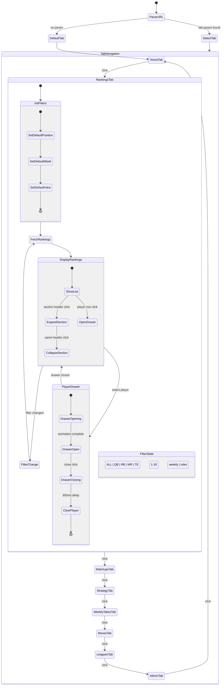

**File:** `client/src/components/tabs/RankingsTab.tsx`

---

## 8. Start/Sit Decision Engine

Multi-factor recommendation system.

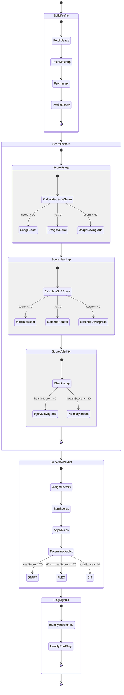

**Verdict States:**
- `START`: High confidence play (>70)
- `FLEX`: Context-dependent (40-70)
- `SIT`: Avoid this week (<40)

**File:** `server/modules/startSit/startSitAgent.ts`

---

## 9. Intelligent Scheduler Service

SLA-aware job scheduling system.

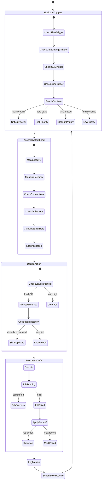

**Freshness States:**
- `fresh`: lastCommit <= lastProcessing
- `stale`: processing behind by < threshold
- `critical`: processing behind by >= threshold

**File:** `server/services/IntelligentScheduler.ts`

---

## 10. Football Lens Validation Rules

Position-specific issue detection state machine.

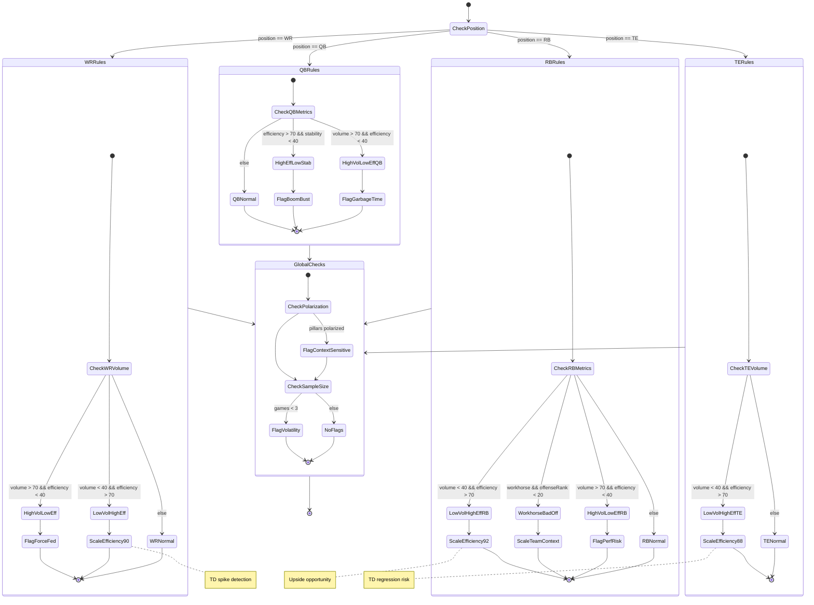

**File:** `server/modules/forge/forgeFootballLens.ts`

---

## Summary

| Component | Primary Pattern | Key Files |
|-----------|----------------|-----------|
| Recursive Alpha | Week-over-week state persistence | `recursiveAlphaEngine.ts`, `forgeStateService.ts` |
| FORGE Engine | ELT Pipeline (Bronze→Silver→Gold) | `forgeEngine.ts` |
| Alpha Calibration | Multi-stage transformation | `alphaEngine.ts` |
| Dynasty Context | Injury-aware branching | `forgeEngine.ts:641-850` |
| ForgeLab | Async data fetch + UI state | `ForgeLab.tsx` |
| PlayerPage | Multi-query coordination | `PlayerPage.tsx` |
| RankingsTab | Filter + drawer pattern | `RankingsTab.tsx` |
| Start/Sit | Multi-factor decision tree | `startSitAgent.ts` |
| Scheduler | SLA-aware job control | `IntelligentScheduler.ts` |
| Football Lens | Position-specific rule engine | `forgeFootballLens.ts` |
